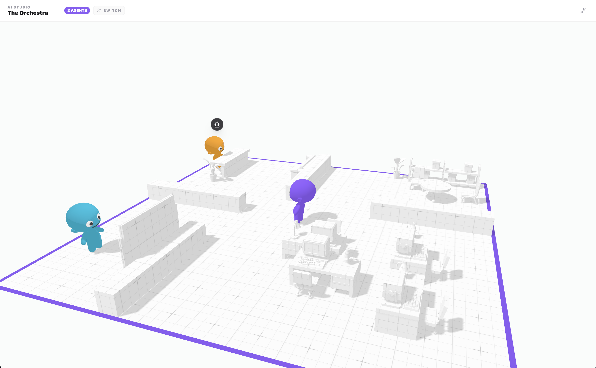
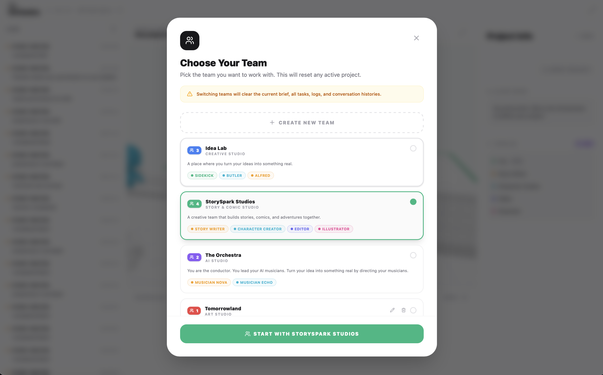
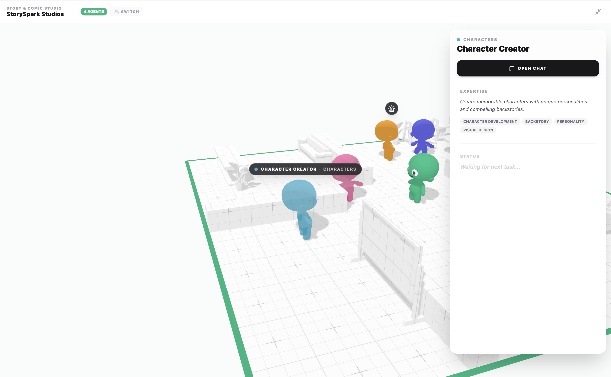

# 🎭 The Orchestra

A kid-friendly AI assistant app with animated agents.

<p align="center">
  
</p>

---

## About the Project

**What if kids could learn to direct AI agents by watching them work in real-time?**

The Orchestra is a macOS app that lets children see how AI agents work, understand what they're doing, and learn how to direct them effectively. It's a training ground for the emerging skill of managing AI agents.

Unlike traditional chat interfaces, The Orchestra makes AI agents feel **alive** — 3D animated characters walk around an office, sit at desks, work on tasks, and talk to each other. Kids can watch their agents think, use tools, and complete real work.

### Core Idea

This system allows kids to:
- 🎬 **Watch agents work** in real-time through animated 3D characters
- 🧠 **Understand cause and effect** — see how their instructions translate to agent actions
- 💡 **Learn to prompt better** — better instructions lead to better outcomes
- 👥 **Manage multiple agents** — coordinate a team of AI assistants

---

## 📸 Screenshots

<table>
  <tr>
    <td></td>
    <td></td>
  </tr>
  <tr>
    <td align="center">Create & switch teams</td>
    <td align="center">Chat with agents</td>
  </tr>
</table>

---

## ✨ Features

### 🧒 Kid-Friendly Interface
- **3D Animated Agents**: Characters walk, sit, work, and talk with expressive animations
- **Permission Popups**: Kid-friendly design with emojis and simple "Sure! ✓" / "No thanks" buttons
- **Activity Log**: See every action agents take (bash commands, file edits, web searches)

### 🤖 Real AI, Real Work
- **Powered by Claude Code**: Real AI agents doing actual work, not simulations
- **Multiple Agents**: Run several agents in parallel, each with their own session
- **Live Event Tracking**: Watch tool use, task completion, and agent thinking in real-time

### 💬 Inter-Agent Communication
- **@Mentions**: Agents can send messages to teammates using `@AgentName: your message`
- **Smart Routing**: When an agent's response contains an @mention, the app parses it and routes the message to the target agent's tmux session
- **Chat History**: Inter-agent messages appear in both agents' chat panels with a distinct style
- **Popup Notifications**: When an agent receives a message from a teammate, a popup appears with "Ignore" and "Open Chat" buttons
- **Team Awareness**: Each agent's CLAUDE.md includes a team directory so they know who their teammates are

### 🔒 Safe & Controlled
- **Permission System**: Approve or deny agent actions before they happen
- **Session Isolation**: Each agent runs in its own tmux session
- **Parental Oversight**: Full visibility into everything agents do

---

## 🛠 Tech Stack

- **Engine**: Three.js with WebGPU for 3D rendering
- **UI**: React with Zustand for state management
- **Backend**: Swift (macOS native)
- **AI**: Claude Code CLI integration
- **Sessions**: tmux for isolated agent processes
- **Bundled**: tmux binary included — no external dependencies

---

## 📋 Requirements

- macOS 14.0+ (Sonoma)
- Xcode 15+ (for Swift 5.10)
- Claude Code CLI installed

---

## 🚀 Build & Run

```bash
# Clone the repo
git clone https://github.com/devpras22/the-orchestra.git
cd the-orchestra
swift build
swift run the-orchestra
```

---

## 🔧 Build Pipeline

After React changes:
```bash
cd _delegation-reference
npm run build
cp -r dist/* ../Sources/Resources/web/
cd ..
swift build
```

---

## 📁 Project Structure

```
theOrchestra/
├── Sources/           # Swift code
│   ├── bin/tmux       # Bundled tmux binary
│   └── Resources/web/ # React UI
├── _delegation-reference/  # React app (3D interface)
└── Package.swift
```

---

## 🎭 Agent Personalities

Each agent has a personality that gets injected into Claude Code. When you send a message to an agent, The Orchestra automatically creates a `CLAUDE.md` file that tells Claude who it is.

**Where personalities are stored:**
```
~/Library/Application Support/The Orchestra/agents/{companyId}/{agentIndex}/CLAUDE.md
```

For example, Musician Nova in "The Orchestra" company:
```
~/Library/Application Support/The Orchestra/agents/the-orchestra/1/CLAUDE.md
```

**To customize an agent's personality:**
1. Navigate to the agent's directory (see above)
2. Edit the `CLAUDE.md` file
3. Restart the app or start a new chat with that agent

The personality includes: role, department, mission, and personality traits.

---

## 🗺 Roadmap

- ✅ **Create Teams in UI** — Let kids create new teams/companies in the app
- ✅ **Edit/Delete Teams** — Modify or remove custom teams
- ✅ **Inter-Agent Communication** — Agents can message each other and collaborate on tasks
- 🚧 **Working Kanban Board** — Activate the task board UI to track agent progress
- 🔮 **Enhanced Activity View** — Better visualization of what agents are doing in real-time
- 🔮 **Headless Mode** — Capture tmux output and display in Orchestra UI instead of hidden Terminal.app
- 🔮 **Learning Mode** — Structured lessons on prompt engineering and agent management
- 🔮 **Multi-Language Support** — Agents that can teach and work in different languages

---

## 🙏 Acknowledgments

This project builds upon the amazing work of:
- **[The Delegation](https://github.com/arturitu/the-delegation)** — The 3D multi-agent React interface with animated avatars
- **[MASKO](https://github.com/RousselPaul/masko-code)** — The backend for parsing Claude Code terminal output into structured events

---

## 📄 License

This project follows a dual-licensing model inherited from its sources:

- **Source Code (MIT):** All Swift code and logic are free to use, modify, and distribute.
- **3D Models & Assets (CC BY-NC 4.0):** The 3D office and character models are Copyright © 2026 **Arturo Paracuellos (unboring.net)**. They are free for personal and educational use but _cannot_ be used for commercial purposes without permission.

The MASKO backend code is under **MIT License — Copyright (c) 2026 Masko**.

---

## ⚠️ Disclaimer

This project has no cryptocurrency or token associated with it.
